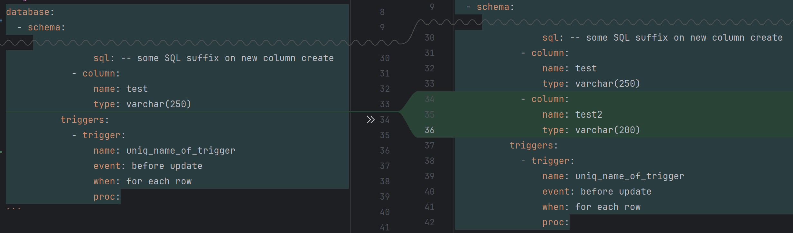

## Declarative schema in a YAML file format

The schema provided there: [schema](src/schema.yaml). The yaml-validator is use to check the schema validity.

Key features: 

> [!TIP]
> - Track schema changes in a single file with github history
> - Aggregate changes from multiple commiters and tolerate to execution order
> - The app will append DB structure with generated SQL safely,  and will not perform destructive SQL 


### Track schema changes



### Most often case during development: add column

SQL:
```sql
create table test (
    column defenition,
    new_column int -- adding this
)
```

but this wont work, if you already have a table. So

```sql
alter table test add column IF NOT EXISTS new_column int;
```
but this wont work if you do not have a table.


### Support plain SQL as inserts into a column creation statement

```yaml
          columns:
            - column:
                name: id
                type: serial
                sql: -- some SQL suffix on new column create
```

Also work for many other places like table, constraint and triggers

> [!NOTE]
> Changing this SQL wont update a DB schema
 

